# Проект автоматизации тестирования для мобильного приложения [uHabits](https://github.com/iSoron/uhabits)

<p align="center">
  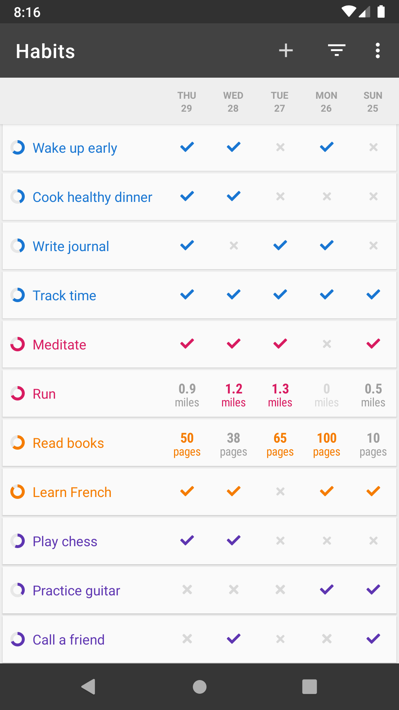
  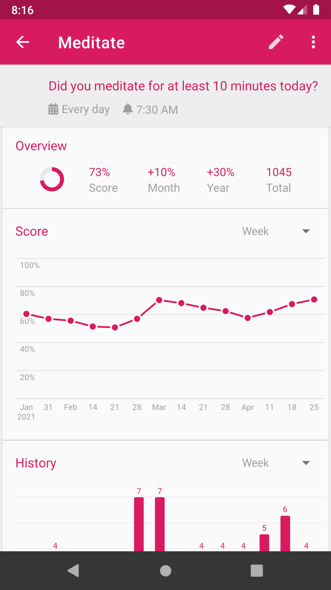
  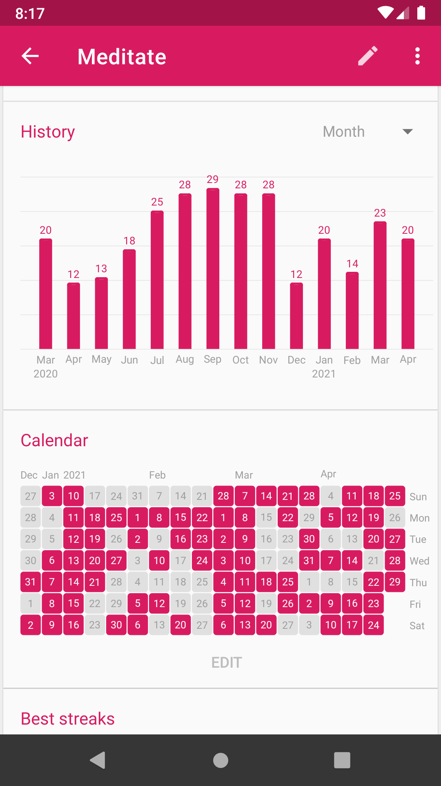
</p>
<p align="center">
  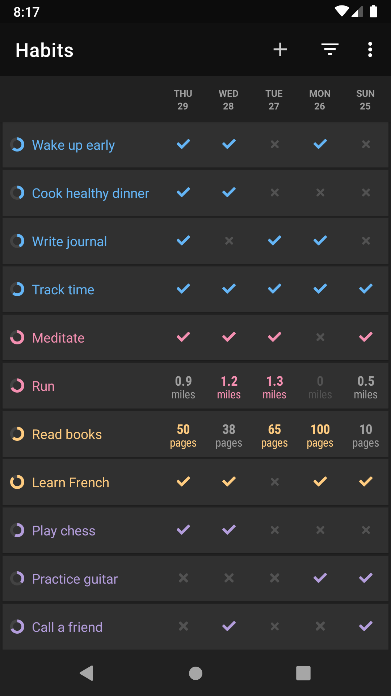
  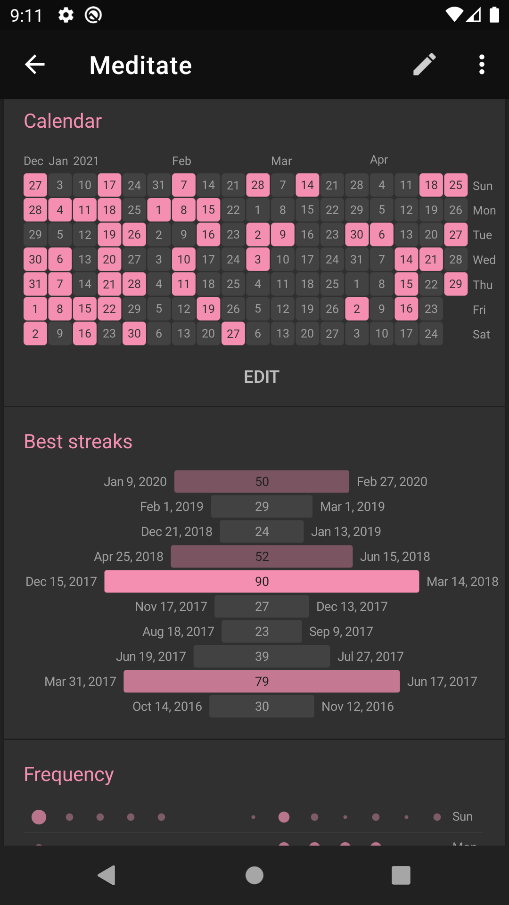
  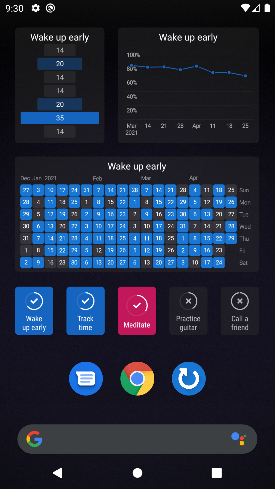
</p>

## **Содержание:** ##

* <a href="#description">Описание</a>

* <a href="#tools">Технологии и инструменты</a>

* <a href="#cases">Пример проверок по автоматизации</a>

* <a href="#jenkins">Сборка в Jenkins</a>

* <a href="#console">Локальный запуск</a>

* <a href="#allure">Allure отчет</a>

* <a href="#testops">Интеграция с Allure TestOps</a>

* <a href="#jira">Интеграция с Jira</a>

* <a href="#telegram">Отправка результатов в Telegram-бота</a>

-----
<a id="description"></a>
## <a name="Описание">**Описание:**</a>


**🧙️[uHabits](https://github.com/iSoron/uhabits)** — это мобильное приложение с открытым исходным кодом, предназначенное для создания и поддержания полезных привычек, помогая пользователям достигать долгосрочных целей.

- **Простой и минималистичный интерфейс**: uHabits предлагает элегантный и понятный интерфейс, удобный даже для новичков.

- **Гибкие расписания**: приложение поддерживает привычки с различной периодичностью, например, 3 раза в неделю или через день.

- **Напоминания**: возможность настраивать уведомления для каждой привычки в выбранное время дня.

- **Виджеты**: цветные виджеты позволяют отслеживать привычки прямо с главного экрана без необходимости открывать приложение.

- **Экспорт данных**: поддержка экспорта данных в CSV или SQLite для дальнейшего анализа или переноса в другие сервисы.

- **Полностью бесплатное и без рекламы**: приложение не содержит рекламы и не требует покупок внутри приложения.

- **Работает офлайн и уважает вашу конфиденциальность**: uHabits не требует подключения к интернету и не отправляет ваши данные третьим лицам.

- **Простой и минималистичный интерфейс**: uHabits предлагает элегантный и понятный интерфейс, удобный даже для новичков.

- **Гибкие расписания**: приложение поддерживает привычки с различной периодичностью, например, 3 раза в неделю или через день.

- **Напоминания**: возможность настраивать уведомления для каждой привычки в выбранное время дня.

- **Виджеты**: цветные виджеты позволяют отслеживать привычки прямо с главного экрана без необходимости открывать приложение.

- **Экспорт данных**: поддержка экспорта данных в CSV или SQLite для дальнейшего анализа или переноса в другие сервисы. 

- **Полностью бесплатное и без рекламы**: приложение не содержит рекламы и не требует покупок внутри приложения.

- **Работает офлайн и уважает вашу конфиденциальность**: uHabits не требует подключения к интернету и не отправляет ваши данные третьим лицам.

<a id="tools"></a>
## <a name="Технологии и инструменты">**Технологии и инструменты:**</a>

<p align="center">
<a href="https://www.jetbrains.com/idea/" target="_blank">
    
</a>
<a href="https://www.java.com/" target="_blank">
    
</a>
<a href="https://selenide.org/" target="_blank">
    
</a>
<a href="https://developer.android.com/" target="_blank">
    
</a>
<a href="https://github.com/appium/appium-inspector" target="_blank">
    
</a>
<a href="https://appium.io/" target="_blank">
    
</a>
<a href="https://www.browserstack.com/" target="_blank">
    
</a>
<a href="https://allurereport.org/" target="_blank">
    
</a>
<a href="https://gradle.org/" target="_blank">
    
</a>
<a href="https://junit.org/junit5/" target="_blank">
    
</a>
<a href="https://github.com/" target="_blank">
    
</a>
<a href="https://www.jenkins.io/" target="_blank">
    
</a>
<a href="https://telegram.org/" target="_blank">
    
</a>
</p>

* Авто-тесты для мобильного приложения Android написаны на Java.
* В качестве сборщика использовался Gradle.
* В качестве тестовых фреймворков применялись JUnit 5, Appium и Selenide.
* В качестве драйвера для Android использовался UIAutomator2.
* Тесты могли выполняться на реальном устройстве, эмуляторе, а также имели интеграцию с облачной платформой BrowserStack для мобильного тестирования.
* Для взаимодействия с API BrowserStack использовался Rest-assured.
* Для удалённого запуска был настроен Jenkins job с генерацией отчёта Allure и отправкой результатов в Telegram через бота.
* Установлена интеграция с Allure TestOps и Jira.

----
<a id="cases"></a>
## **Примеры автоматизированных тест-кейсов**

### Создание привычек

- ✅ Создать привычку типа «Да/Нет»
- ✅ Создать измеримую привычку

### Онбординг

- ✅ Проверить онбординг приложения: заголовок, описание, изображение, кнопки «Пропустить» и «Далее»

### Работа с привычками

- ✅ Удалить привычку

----
<a id="jenkins"></a>
## Сборка в Jenkins ([link](https://jenkins.autotests.cloud/view/QA.GURU%20students/job/c36-oPalushina-habits_mobile_tests/))
<p align="center">  
<a href="https://jenkins.autotests.cloud/view/QA.GURU%20students/job/c36-oPalushina-habits_mobile_tests/">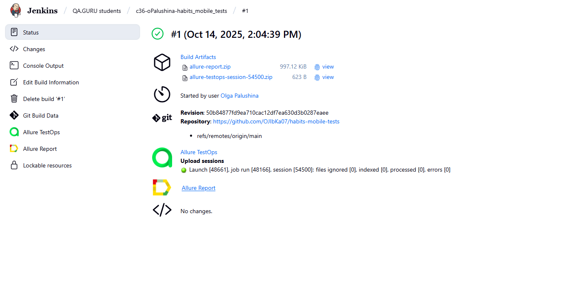</a>  
</p>

----
<a id="console"></a>
## Запуск из терминала

**Локальный запуск**
```bash  
gradle clean test -DdeviceHost=local
```

**Удаленный запуск из Jenkins**
```bash
clean test -DdeviceHost=remote
```

----
<a id="allure"></a>
## Allure отчет ([link](https://jenkins.autotests.cloud/view/QA.GURU%20students/job/c36-oPalushina-habits_mobile_tests/1/allure/))

**Страница отчета**
<p align="center">  
<a href="https://jenkins.autotests.cloud/view/QA.GURU%20students/job/c36-oPalushina-habits_mobile_tests/1/allure/">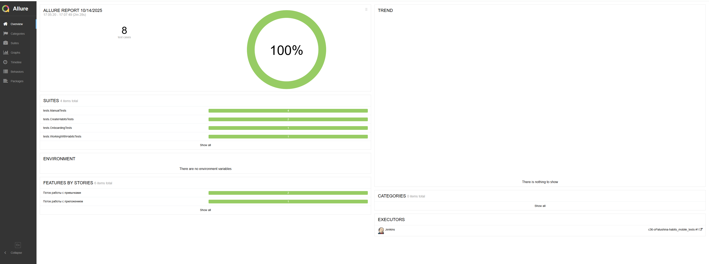</a>  
</p>

**Тест-кейсы**
<p align="center">  
<a href="https://jenkins.autotests.cloud/view/QA.GURU%20students/job/c36-oPalushina-habits_mobile_tests/1/allure/">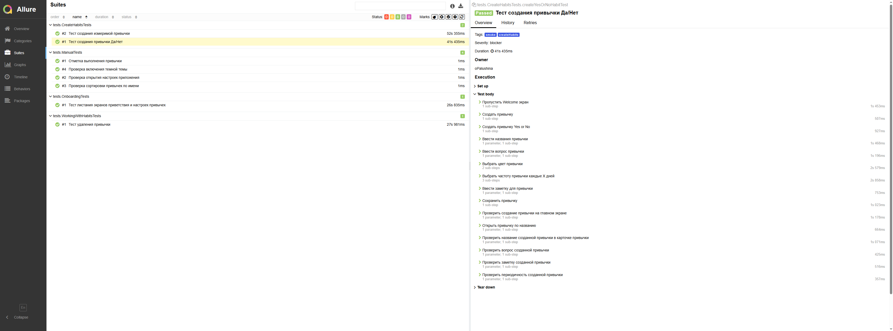</a>  
</p>


----
<a id="testops"></a>
## Интеграция Allure TestOps ([link](https://allure.autotests.cloud/project/4950/dashboards))
<p align="center">  
<a href="https://allure.autotests.cloud/project/4932/dashboards"></a>  
</p>

**Автоматизированные тест-кейсы**
<p align="center">  
<a href="https://allure.autotests.cloud/project/4932/dashboards"></a>  
</p>

**Ручные тест-кейсы**
<p align="center">  
<a href="https://allure.autotests.cloud/project/4932/dashboards"></a>  
</p>

----
<a id="jira"></a>
## Интеграция с Jira ([link](https://jira.autotests.cloud/browse/HOMEWORK-1510))
<p align="center">  
<a href="https://jira.autotests.cloud/browse/HOMEWORK-1504"></a>  
</p>

----
<a id="telegram"></a>
## Отправка результатов в Telegram-бота
<p align="center">  
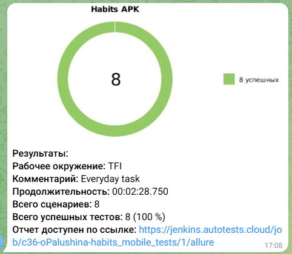 
</p>

----
<a id="telegram"></a>
## Видео пример запуска тестов в Browserstack
<p align="center">  
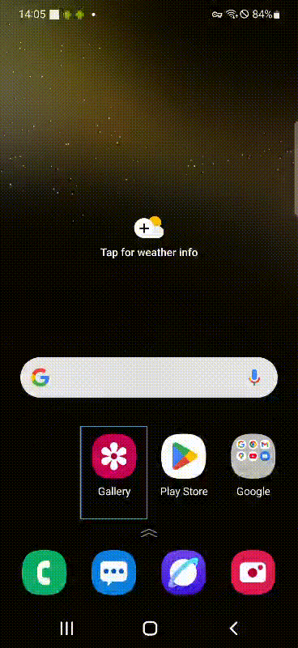 
</p>

