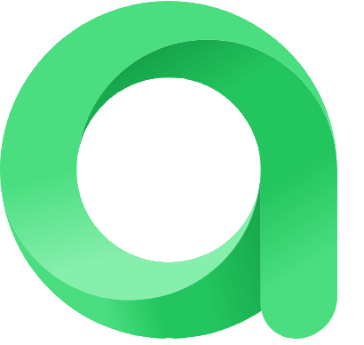

# Проект по автоматизации тестовых сценариев для мобильного приложения HABITS
## :scroll: Содержание:

- [Используемый стек](#computer-используемый-стек)
- [Запуск автотестов](#arrow_forward-запуск-автотестов)
- [Примеры автоматизированных тестов](#пример-тест-кейсов)
- [Сборка в Jenkins](#-сборка-в-jenkins)
- [Пример Allure-отчета](#-пример-allure-отчета)
- [Результат успешного прогона](#-результат-успешного-прогона)
- [Уведомления в Telegram](#-уведомления-в-telegram-с-использованием-бота)
- [Видео примера запуска тестов в Browserstack](#-видео-пример-запуска-тестов-в-Browserstack)

## :computer: Используемый стек

<p align="center">
<a href="https://www.jetbrains.com/idea/" target="_blank">
    
</a>
<a href="https://www.java.com/" target="_blank">
    
</a>
<a href="https://selenide.org/" target="_blank">
    
</a>
<a href="https://developer.android.com/" target="_blank">
    
</a>
<a href="https://github.com/appium/appium-inspector" target="_blank">
    
</a>
<a href="https://appium.io/" target="_blank">
    
</a>
<a href="https://www.browserstack.com/" target="_blank">
    
</a>
<a href="https://allurereport.org/" target="_blank">
    
</a>
<a href="https://gradle.org/" target="_blank">
    
</a>
<a href="https://junit.org/junit5/" target="_blank">
    
</a>
<a href="https://github.com/" target="_blank">
    
</a>
<a href="https://www.jenkins.io/" target="_blank">
    
</a>
<a href="https://telegram.org/" target="_blank">
    
</a>
</p>

* Авто-тесты для мобильного приложения Android написаны на Java.
* В качестве сборщика использовался Gradle.
* В качестве тестовых фреймворков применялись JUnit 5, Appium и Selenide.
* В качестве драйвера для Android использовался UIAutomator2.
* Тесты могли выполняться на реальном устройстве, эмуляторе, а также имели интеграцию с облачной платформой BrowserStack для мобильного тестирования.
* Для взаимодействия с API BrowserStack использовался Rest-assured.
* Для удалённого запуска был настроен Jenkins job с генерацией отчёта Allure и отправкой результатов в Telegram через бота.
* Установлена интеграция с Allure TestOps и Jira.

## :arrow_forward: Запуск автотестов

### Запуск тестов из терминала
```
./gradlew clean test -DdeviceHost=remote
```
При выполнении данной команды в терминале IDE тесты запустятся удаленно в <code>Browserstack</code>.

<code>clean</code> — удаляет каталог build/ в проекте (все скомпилированные классы, отчёты, кэш тестов, временные файлы);

<code>test</code> — запускает задачу тестирования Gradle, которая:

- компилирует тесты и основной код;
- запускает тесты (JUnit, TestNG и т.д.);
- формирует отчёты (например, `build/reports/tests/test/index.html`).

<code>-DdeviceHost</code> — принимает значения local/remote, запускает задачу тестирования Gradle. 
При значении <code>remote</code> тесты запускаются удаленно в Browserstack; 
при <code>local</code> - на локально запущенном устройстве из Android Studio.

## Пример тест-кейсов

### Создание привычек

- ✅ Создать привычку типа «Да/Нет»
- ✅ Создать измеримую привычку

### Онбординг

- ✅ Проверить онбординг приложения: заголовок, описание, изображение, кнопки «Пропустить» и «Далее»

### Работа с привычками

- ✅ Удалить привычку

##  Сборка в Jenkins
[Сборка в Jenkins](https://jenkins.autotests.cloud/view/QA.GURU%20students/job/c36-oPalushina-habits_mobile_tests/)
<p align="center">
    
</p>

##  Пример Allure-отчета
### Overview
[Allure  отчет](https://jenkins.autotests.cloud/view/QA.GURU%20students/job/c36-oPalushina-qa_guru-booking/1/allure/)
<p align="center">
    
</p>

##  Результат успешного прогона
### Overview

<p align="center">

</p>

###  Уведомления в Telegram с использованием бота

После завершения сборки специальный бот, созданный в <code>Telegram</code>, автоматически обрабатывает и отправляет сообщение с результатом.

<p align="center">

</p>

###  Видео пример запуска тестов в Browserstack

К каждому тесту в отчете прилагается видео прогона.
<p align="center">
  
</p>
